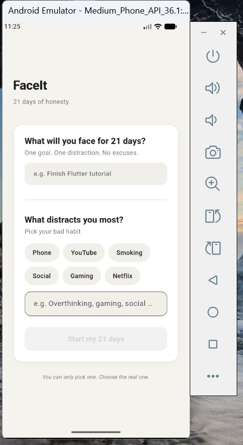
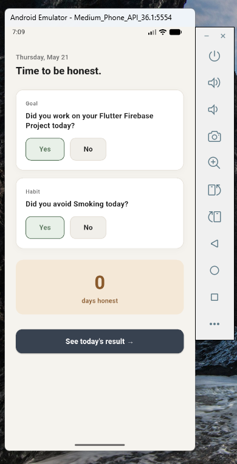
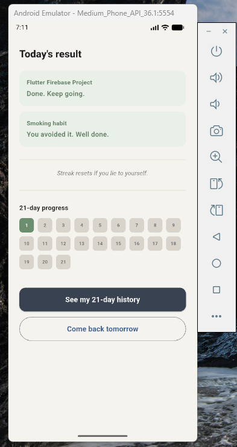
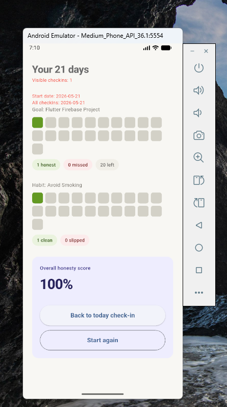
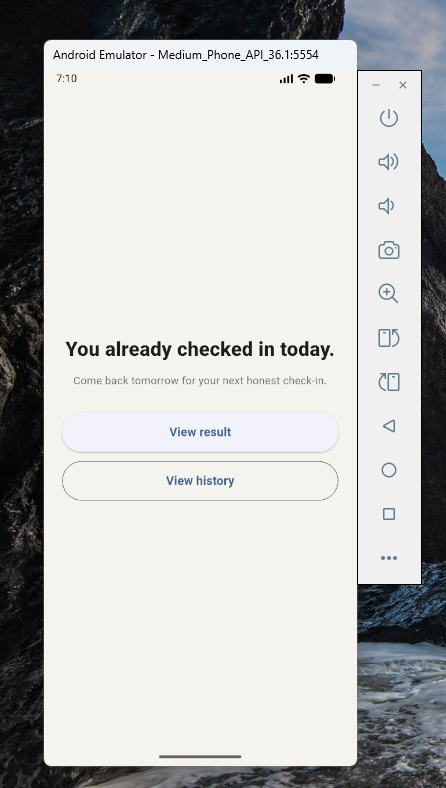

# FaceIt / OwnIt

A Flutter accountability app that helps users stay honest with their daily goals and bad habits.

The idea is simple:  
not just a task manager, but a mirror.  
Every day, the user checks whether they completed their goal and avoided their distraction.

## Features

- Daily check-in system
- Goal tracking
- Bad habit / distraction tracking
- 21-day progress grid
- Firebase Firestore integration
- Clean Flutter UI
- Riverpod state management

## Screenshots

### Setup Screen


### Check-in Screen


### Result Screen


### History Screen


### Already Checked-in Screen


## Tech Stack

- Flutter
- Dart
- Firebase
- Cloud Firestore
- Riverpod

## App Flow

1. User enters a goal.
2. User selects a bad habit or distraction.
3. User completes a daily check-in.
4. The app saves the result in Firestore.
5. The result screen shows progress over 21 days.

## Firestore Structure

```text
users/
  user_001/
    checkins/
      auto_doc_id/
        date
        goal
        habit
        goalDone
        habitAvoided
        ## Current Status

This project is currently a portfolio MVP.

The main goal of this project is to demonstrate practical Flutter development skills, including Firebase integration, Cloud Firestore usage, Riverpod state management, clean UI structure, and feature-based architecture.

## Planned Improvements

- Add authentication
- Replace the hardcoded user ID with real user accounts
- Improve the history screen
- Add an app icon
- Add a splash screen
- Add more animations
- Add a production-ready privacy policy